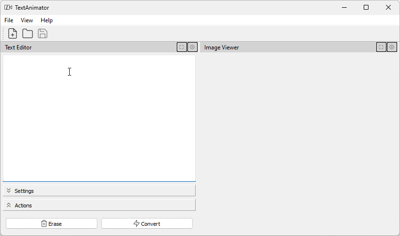

# TextAnimator
## _Convert any text to an animated SVG file_


TextAnimator is a tool to animate text as if it is being written letter by letter.

## Features

-- Create animated text with different font families, sizes and colors
-- Retrieve ASCII arts from [patorjk](https://patorjk.com/software/taag/#p=display&f=Graffiti&t=TextAnimator) and create animated texts
-- Save/Open the animated texts in SVG
-- more to come ...

## Prerequisites

- python

## Build

### Windows

Execute the following command
```bat
.\buildWindows.bat
```

### Linux

Execute the following command
```sh
./buildLinux.sh
```

## Demo


